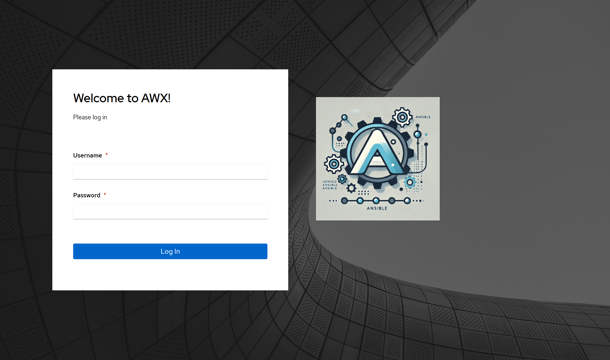
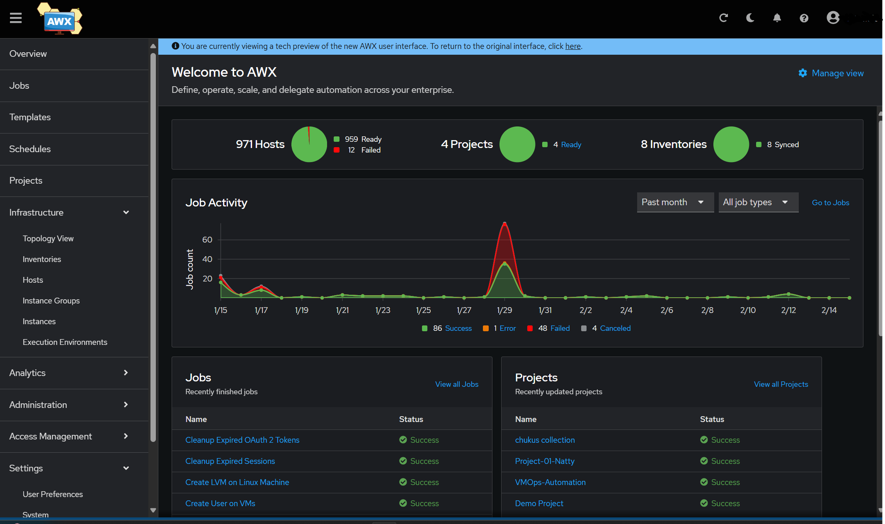
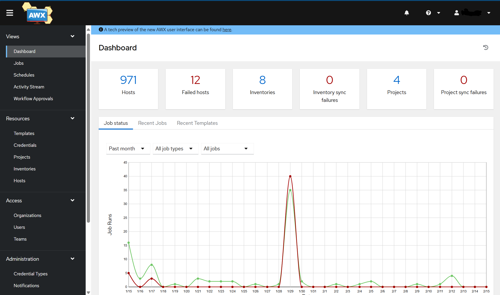

# Ansible Playbook Repository

This repository contains a collection of Ansible playbooks for various automation tasks, including AWX configuration, agent installation, and system management.

## Table of Contents

- [Included Playbooks](#included-playbooks)
- [Usage](#usage)
- [Screenshots](#screenshots)

## Included Playbooks

The repository is organized into several directories, each containing playbooks for specific purposes:

- **AIX_Machines_playboooks**: Playbooks for managing AIX machines.
- **Agent_installation**: Automation for installing various agents.
- **Cluster-Management-Playbooks**: Playbooks for managing clusters.
- **JoinMachinestoActiveDirectory**: Automation for joining machines to Active Directory.
- **disk_management-playbook**: Playbooks for disk management tasks.
- **exchange-server-playbooks**: Automation for Exchange Server management.
- **usermanagement-playbook**: Playbooks for user management.

## Usage

These playbooks are designed to be used with Ansible or AWX/Ansible Tower.

1.  **Clone the repository:**
    ```bash
    git clone <repository-url>
    ```

2.  **Navigate to the desired playbook directory:**
    ```bash
    cd <playbook-directory>
    ```

3.  **Run the playbook:**
    ```bash
    ansible-playbook -i <inventory-file> <playbook-name>.yml
    ```

    *Note: Ensure you have the necessary permissions and configurations set up before running the playbooks.*

## Screenshots

Here are some screenshots of the AWX dashboard and login screen:

### Login Screen


### AWX Home Dashboard


### AWX Dashboard

